 ###     PIPELINED-PROCESSORS

#### Tổng quan đề tài

Đề tài này là một dự án thuộc môn Kiến trúc Máy tính tại Trường Đại học Bách Khoa TP. Hồ Chí Minh, với mục tiêu thiết kế và mô phỏng một bộ xử lý dựa trên kiến trúc RISC-V. Nội dung chính của đề tài tập trung vào việc nghiên cứu và đánh giá các mô hình xử lý pipeline hazard, đặc biệt là control hazard do lệnh nhánh, thông qua nhiều kỹ thuật dự đoán nhánh khác nhau.

Theo yêu cầu của đề tài do nhà trường đưa ra, dự án bao gồm năm mô hình xử lý:

- Non Forwarding

- Forwarding – Not Taken

- Forwarding – Taken

- Dự đoán nhánh 2-bit

- GShare

Ngoài các mô hình trên, em đã chủ động nghiên cứu và triển khai thêm một mô hình nâng cao là **Tagged Geometric Predictor**, nhằm cải thiện độ chính xác dự đoán và hiệu năng tổng thể của pipeline. Việc mở rộng này không nằm trong yêu cầu ban đầu của đề tài.

Nhờ hoàn thành đầy đủ các yêu cầu cũng như mở rộng thêm mô hình dự đoán nhánh mới, em đã nhận được phần điểm cải tiến, đề tài đã được đánh giá điểm tối đa **(10 điểm)** cho phần bài tập lớn, và đạt điểm tổng kết môn học là **9.9 điểm (A+)**.

 
#### 1. Giới thiệu chung

Trong bộ xử lý pipeline, hiệu năng tổng thể phụ thuộc rất lớn vào mức độ hiệu quả của việc xử lý các pipeline hazard, đặc biệt là data hazard và control hazard phát sinh từ các lệnh nhánh. Khi không có các cơ chế xử lý phù hợp, pipeline buộc phải chèn các chu kỳ chờ (stall) hoặc loại bỏ lệnh (flush), dẫn đến suy giảm đáng kể hiệu năng hệ thống.

Nhằm nghiên cứu và đánh giá các kỹ thuật xử lý hazard khác nhau, đề tài này thực hiện thiết kế và mô phỏng sáu mô hình pipeline với mức độ phức tạp tăng dần. Các mô hình bao gồm pipeline có và không sử dụng data forwarding, cũng như nhiều chiến lược dự đoán nhánh khác nhau, từ các phương pháp tĩnh đơn giản đến các bộ dự đoán động nâng cao. Mục tiêu của đề tài là phân tích ảnh hưởng của từng kỹ thuật lên hành vi pipeline, thông lượng lệnh và hiệu quả thực thi tổng thể của bộ xử lý.

#### 2. Mô tả các mô hình Pipeline
- ##### 2.1. Pipeline không Forwarding (Non-forwarding Pipeline)

Mô hình pipeline không forwarding là một thiết kế bộ xử lý pipeline cơ bản, trong đó cơ chế chuyển tiếp dữ liệu (data forwarding) không được triển khai. Khi xảy ra data hazard, cụ thể là khi một lệnh phụ thuộc vào kết quả của lệnh trước đó nhưng kết quả này vẫn chưa được ghi về thanh ghi trong giai đoạn write-back, pipeline buộc phải dừng (stall) cho đến khi dữ liệu cần thiết trở nên sẵn sàng trong tập thanh ghi.

Mô hình này được sử dụng làm mốc so sánh (baseline), nhằm minh họa rõ ràng mức độ suy giảm hiệu năng do các chu kỳ dừng pipeline gây ra khi các phụ thuộc dữ liệu chưa được giải quyết.

- [Thiết kế Datapath]()
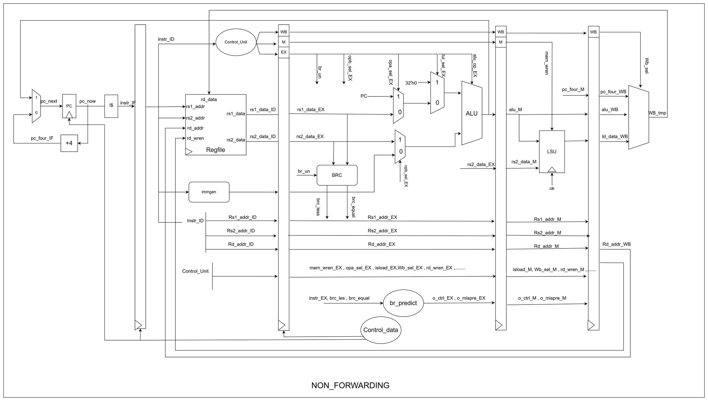

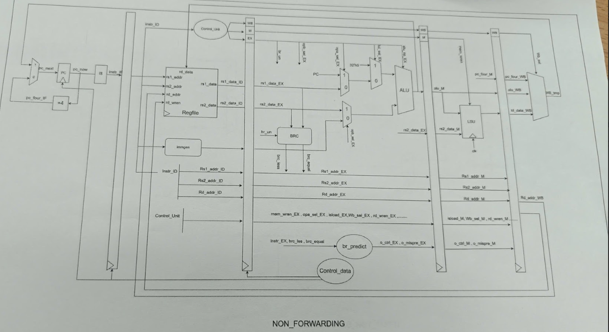
- [Result]()

  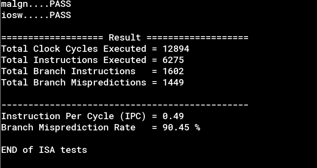

- ##### 2.2. Pipeline có Forwarding với dự đoán nhánh Not Taken

Mô hình pipeline này tích hợp cơ chế chuyển tiếp dữ liệu (data forwarding) nhằm giảm thiểu các data hazard, cho phép các kết quả trung gian được truyền trực tiếp từ các giai đoạn pipeline phía sau về các giai đoạn phía trước mà không cần chờ đến bước ghi thanh ghi (write-back).

Đối với control hazard, pipeline sử dụng chiến lược dự đoán nhánh tĩnh Not Taken, trong đó mọi lệnh nhánh đều được giả định là không rẽ nhánh. Theo cách tiếp cận này, pipeline tiếp tục nạp các lệnh tuần tự ngay sau lệnh nhánh cho đến khi kết quả thực tế của lệnh nhánh được xác định.

Nếu lệnh nhánh thực sự không được thực hiện, quá trình thực thi pipeline diễn ra liên tục mà không bị gián đoạn. Ngược lại, nếu lệnh nhánh được thực hiện (taken), các lệnh đã được nạp sai sẽ bị loại bỏ (flush), và quá trình thực thi sẽ được chuyển hướng đến địa chỉ đích của nhánh.

- [Thiết kế Datapath]()
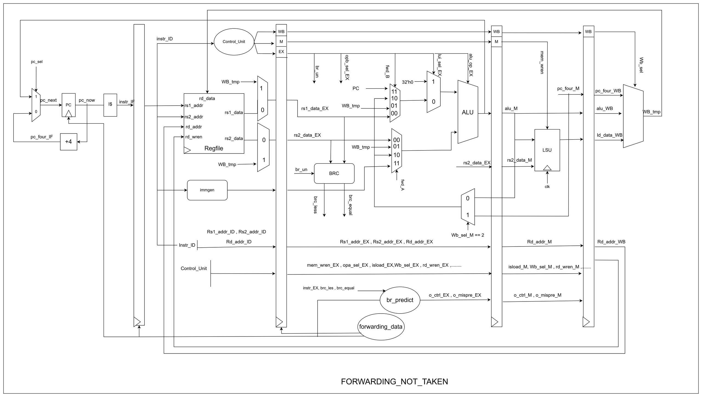

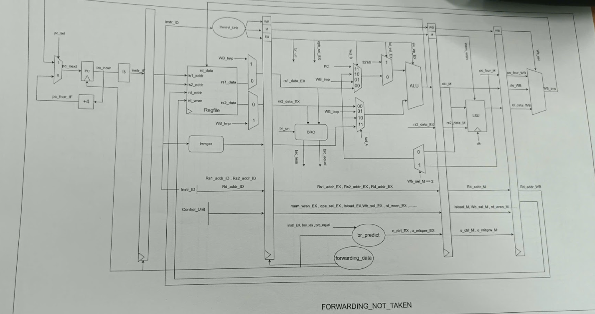
- [Result]()

  

- ##### 2.3. Pipeline có Forwarding với dự đoán nhánh Always Taken

Tương tự như mô hình trước, pipeline này cũng sử dụng cơ chế chuyển tiếp dữ liệu (data forwarding) nhằm xử lý hiệu quả các phụ thuộc dữ liệu giữa các lệnh liên tiếp, từ đó giảm thiểu các chu kỳ dừng pipeline do data hazard.

Chiến lược dự đoán nhánh được áp dụng trong mô hình này là Always Taken, trong đó mọi lệnh nhánh đều được giả định là sẽ rẽ nhánh. Khi gặp một lệnh nhánh, pipeline sẽ ngay lập tức giả định nhánh được thực hiện và bắt đầu nạp các lệnh tại địa chỉ đích của nhánh.

Nếu kết quả dự đoán trùng với kết quả thực tế của lệnh nhánh, pipeline tiếp tục thực thi một cách bình thường. Ngược lại, trong trường hợp dự đoán sai, các lệnh đã được nạp không đúng sẽ bị loại bỏ (flush), và pipeline sẽ tiếp tục thực thi theo luồng điều khiển chính xác.

- [Thiết kế Datapath]()
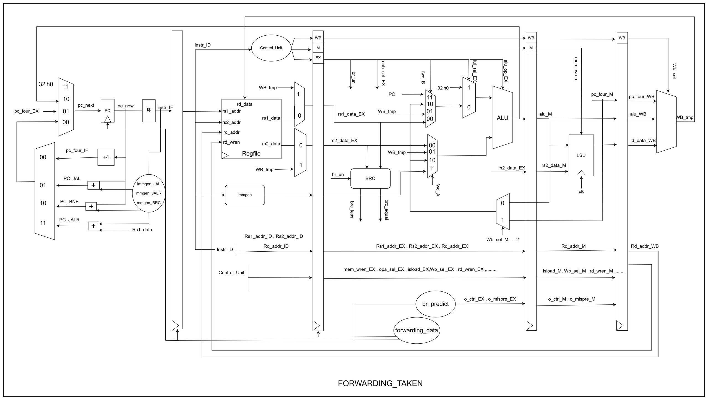

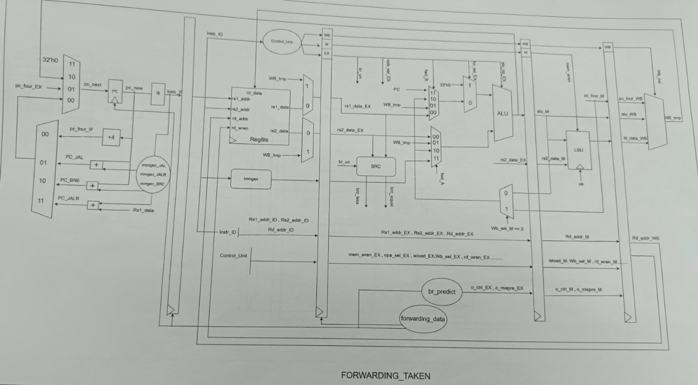
- [Result]()

  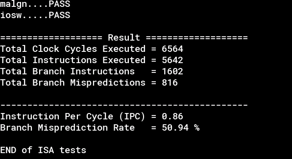

- ##### 2.4. Dự đoán nhánh động hai bit (Two-Bit Dynamic Branch Prediction)

Mô hình này sử dụng bộ dự đoán nhánh động hai bit, trong đó mỗi lệnh nhánh được gắn với một bộ đếm bão hòa 2-bit (2-bit saturating counter) nhằm biểu diễn hành vi rẽ nhánh gần đây của lệnh đó. Bộ đếm này chuyển đổi giữa bốn trạng thái: strongly taken, weakly taken, weakly not taken và strongly not taken, dựa trên kết quả thực tế của các lần thực thi lệnh nhánh.

Bằng cách yêu cầu hai lần dự đoán sai liên tiếp mới làm thay đổi hướng dự đoán, phương pháp này giúp tăng tính ổn định của bộ dự đoán, hạn chế ảnh hưởng của các biến động ngẫu nhiên, đồng thời cho phép bộ dự đoán thích nghi động với hành vi thực tế của chương trình trong quá trình thực thi.

- [Thiết kế Datapath]()
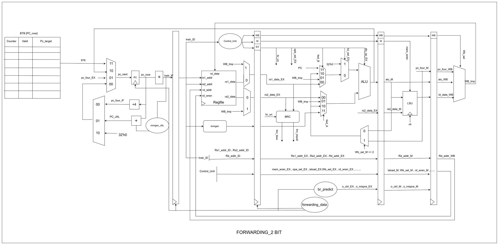

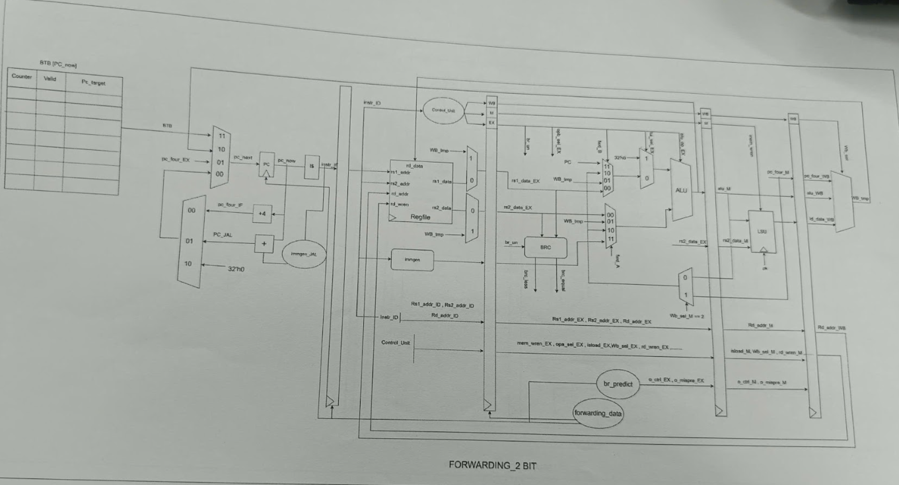
- [Result]()

  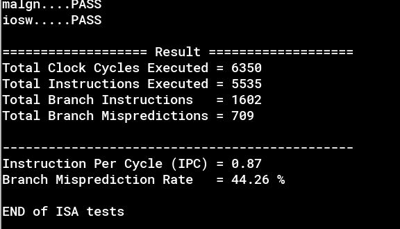

- ##### 2.5. Dự đoán nhánh GShare

GShare là một kỹ thuật dự đoán nhánh động dựa trên lịch sử nhánh toàn cục (global branch history). Trong mô hình này, một thanh ghi lịch sử toàn cục (Global History Register – GHR) được sử dụng để lưu lại kết quả của các lệnh nhánh gần nhất đã được thực thi trong toàn bộ chương trình.

Khi gặp một lệnh nhánh, địa chỉ của lệnh nhánh sẽ được thực hiện phép XOR với nội dung của GHR để tạo ra chỉ số truy cập vào Pattern History Table (PHT). Mỗi phần tử trong bảng này chứa một bộ đếm dự đoán (thường là bộ đếm bão hòa 2-bit), dùng để xác định lệnh nhánh được dự đoán là taken hay not taken.

Cơ chế đánh chỉ số dựa trên phép XOR giúp giảm hiện tượng aliasing trong bảng dự đoán, đồng thời cho phép bộ dự đoán khai thác mối tương quan giữa các lệnh nhánh khác nhau trong luồng thực thi, từ đó cải thiện độ chính xác dự đoán so với các phương pháp dựa trên lịch sử cục bộ.

- [Thiết kế Datapath]()
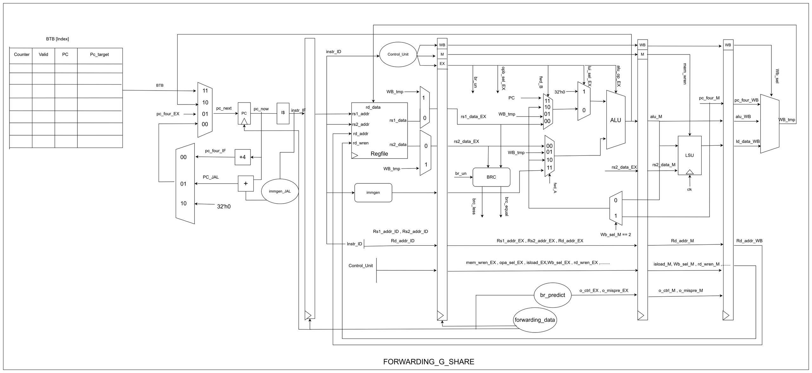

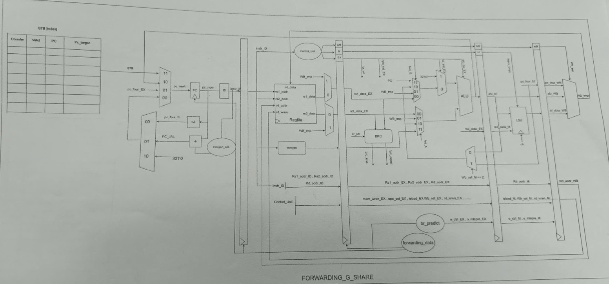
- [Result]()

  

- ##### 2.6. Bộ dự đoán nhánh Tagged Geometric Predictor

Tagged Geometric Predictor là một mô hình dự đoán nhánh nâng cao, được thiết kế nhằm khai thác nhiều độ dài lịch sử nhánh khác nhau một cách đồng thời. Thay vì chỉ sử dụng một độ dài lịch sử toàn cục cố định, bộ dự đoán này duy trì nhiều bảng dự đoán, trong đó mỗi bảng được đánh chỉ số dựa trên một độ dài lịch sử khác nhau, được lựa chọn theo cấp số nhân (geometric progression).

Mỗi mục trong bảng dự đoán không chỉ chứa thông tin dự đoán mà còn bao gồm một tag, được tạo ra từ địa chỉ lệnh nhánh kết hợp với thông tin lịch sử nhánh. Trong quá trình dự đoán, bộ dự đoán sẽ tìm kiếm theo thứ tự phân cấp, bắt đầu từ bảng có độ dài lịch sử lớn nhất. Nếu tìm thấy một mục có tag khớp, kết quả dự đoán tương ứng sẽ được sử dụng. Trong trường hợp không có tag nào phù hợp, bộ dự đoán sẽ lần lượt lùi về các bảng có độ dài lịch sử ngắn hơn.

- [Thiết kế Datapath]()

- [Result]()

  

#### 3. Mô tả chi tiết khối ALU

Trước tiên, các sơ đồ khối chi tiết được thiết kế cho từng khối chức năng riêng lẻ như ALU, LSU và Register File, nhằm mô tả rõ các tín hiệu điều khiển cũng như các phép toán số học – logic được thực hiện bên trong mỗi khối.

Ví dụ, hình minh họa dưới đây trình bày cách thực hiện các phép cộng và trừ trong ALU, bao gồm luồng dữ liệu, tín hiệu điều khiển và quá trình xử lý toán học tương ứng.

- [Diagram]()

  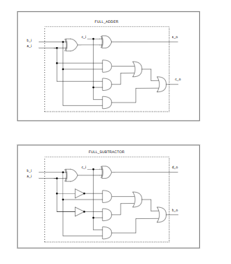

- [Diagram]()
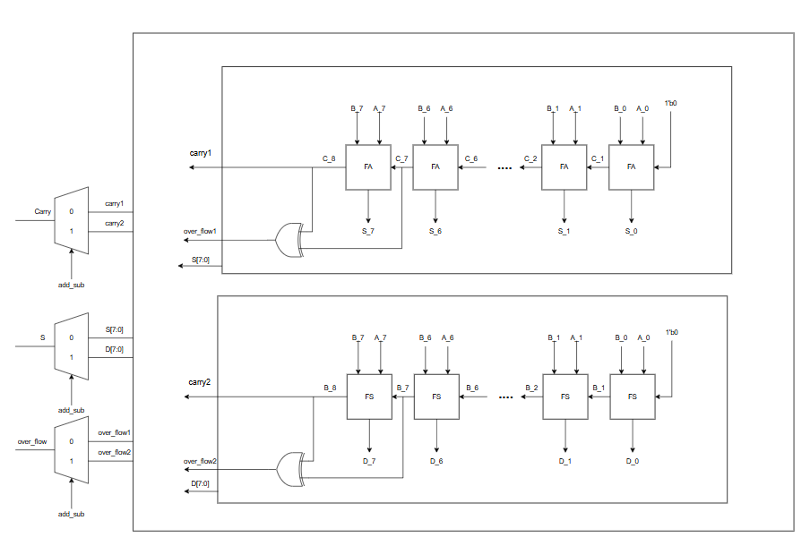

Thứ hai, một testbench được xây dựng nhằm kiểm tra và xác minh tính đúng đắn về mặt chức năng của khối ALU.
- [Test ALU]()

  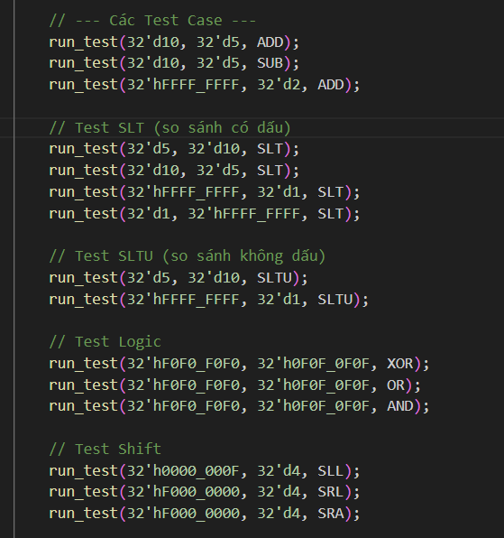

- [Waveform ]()
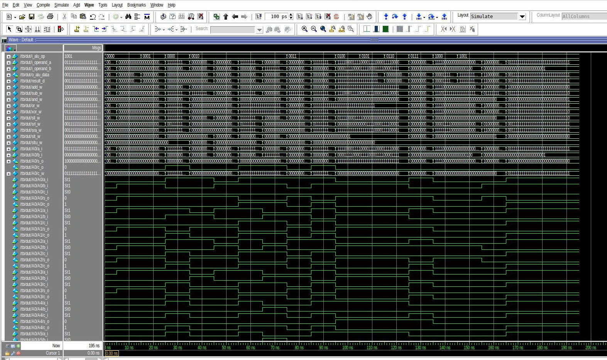

##### Program the DE2 board

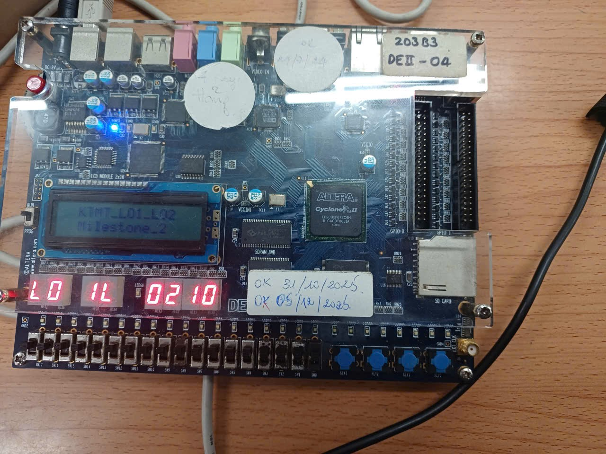

